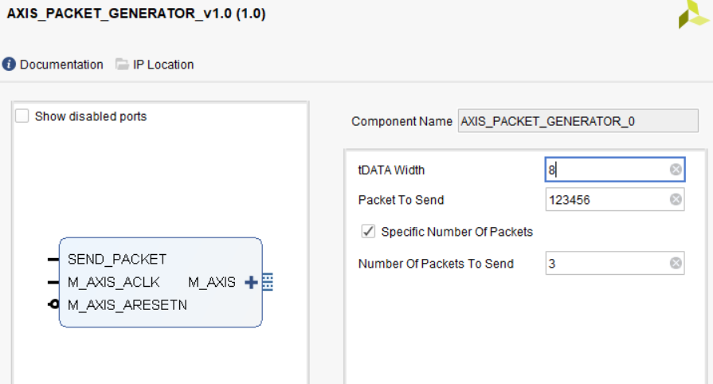

# AXIS Packet Generator
A simple IP to generate specific packets can be used to test others IPs or wherever ypu need to send specific packets repeatedly. 



# Clone and Recreation
This project was built with vivado 2018.2, so make sure you are using this exact version.  
PL projects often come with some custom IPs, these IPs can be HDL or HLS, sth like this: 
```
ip_repo
    ├───HDL
    │   ├───HDL_IP_1
    │   └───HDL_IP_2
    └───HLS
        ├───HLS_IP_1
        └───HLS_IP_2
```
## Recreating the PL Project
Make sure all the dependencies including HLS and HDL repos are correctly placed under the right directory, then in vivado command prompt or TCL Consol of the GUI run: 

``` source c:\...\project_name\project_name.tcl ```

Wait untill recreation is completed. 

Refer to this [repo](https://github.com/iamhosseinali/vivado-git) and look for the right branch based on your vivado version to use vivado and git together like the project above.

